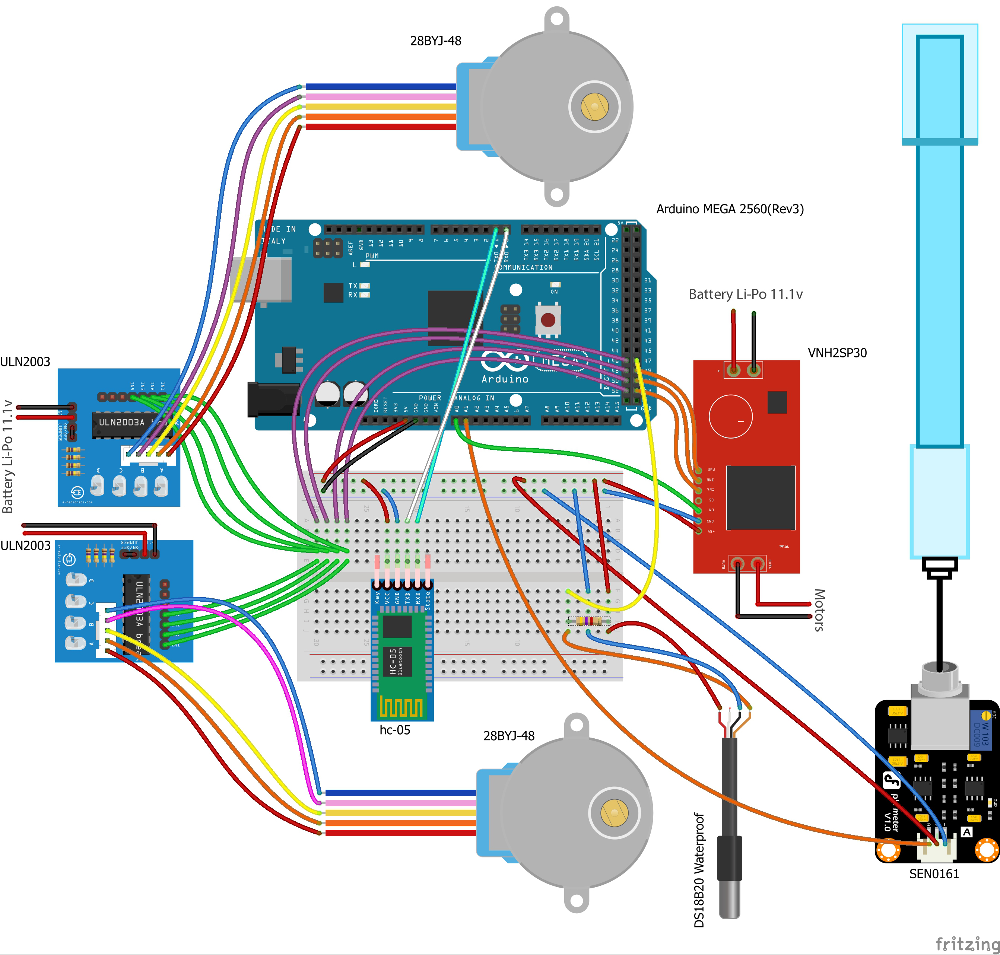

# Environment-ALL

We are Environment-All students in the 1st grade of Saint Demetrios High School, Christina, Vassilis, Elias, Nikolas and our teacher Katerina Asimakopoulou. We decided to participate because the combination of open technologies and Climate Change (as a thematic) not only interests us, but causes us to help solve the problem as much as we can.

# Our Suggestion 
After robot means work, we wondered if there is a robot to process the results of the climate crisis and presents them in a simpler, more concentrated form by graph so their use in the improvement of agricultural production / harvest or green growth in an area, urban or not. After a series of meetings between members of our team, we came to the general functions of our robot. In the beginning we use already existing open source programs and some created by us. 

The RoboKlimUs is capable of taking measurements through specific sensors available 
  - For the atmosphere:
    - Temperature
    - Humidity
    - Quantity of carbon dioxide 
  - For soil:
    - pH
    - Temperature

After each measurement, the data are sent via Bluetooth to a remote computer. The computer holds a large database with information from official sources. The data processed by an application written in Python 3 and with the help of XlsxWriter creating Excel spreadsheets with charts.

These are Images of the Wiring:

# Bonus

### Links
- [3D Robot Preview 1.0 (newest version)][3Dprev]
- [3D Robot Preview (older versions)]

### Communication
  | Name | Team Position | Email |
  | ---- | ------------- | ----- |
  | Asimakopoulou Aikaterinh | Team Leader | kasimako@dad.gr |
  | Iliopoulos Nikolaos | Team Member | nilioprobots@gmail.com |
  | Kalliakmanis Elias | Team Member | hliaskalliakmanis@gmail.com |
  | Keramaris Vasilios | Team Member | - |
  | Tournari Christina | Team Member | xristinatournari@gmail.com |

[3Dprev]: <https://youtu.be/QUXGDTw46SM>
